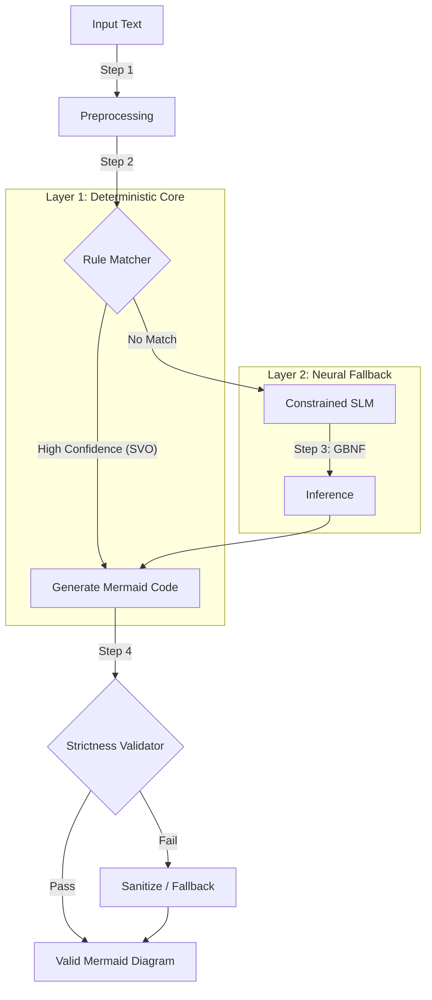

# Hybrid Architecture: Deterministic Natural Language to Mermaid.js Conversion Engine

> **Architectural Paradigm**: Strict Fidelity Conversion  
> **Philosophy**: "What You See Is What You Code" (WYSIWYC)

## Executive Summary

This project implements a **Hybrid Architecture** designed to act as a strict "Conversion Engine" rather than a generative AI assistant. It solves the core challenge of translating natural language (NL) into structured [Mermaid.js](https://mermaid.js.org/) diagramming code without "semantic expansion" (hallucination).

While modern Large Language Models (LLMs) excel at creative generation, they are statistically biased to complete thoughts, leading to inaccurate system diagrams. Our architecture explicitly rejects this behavior, using a hybrid approach that combines **Deterministic Dependency Parsing** with **Constrained Neural Translation** to ensure the output graph represents the input text's exact entities and relationships—and nothing more.

---

## The Problem: Generation vs. Translation

In system design, precision is paramount. A diagram that implies a connection not explicitly stated in the specification can lead to critical engineering errors.

- **Generative Approach (Standard LLM)**: Optimizes for coherence.
  - _Input_: "Server connects."
  - _LLM Output_: `Server -->|connects| Database` (Hallucinated "Database" to complete the thought).
- **Strict Translation Approach (This Engine)**: Optimizes for fidelity.
  - _Input_: "Server connects."
  - _Engine Output_: `Server((Server connects))` or `Server -->|connects| Unknown` (Resolves ambiguity deterministically or acknowledges it).

## Architectural Overview

This system maps linguistic structures to graph topologies using a multi-stage pipeline.

### Layer 1: The Deterministic Core (Rule-Based)

**Primary Logic Layer**

For simple, well-structured sentences, we utilize linguistic isomorphism: the dependency tree of a well-formed sentence mirrors the topological structure of a graph.

- **Technology**: Dependency Parsing (e.g., SpaCy or light-weight equivalents like `compromise`) + ClausIE Logic.
- **Mechanism**:
  - Extracts **Subject** (Source Node), **Verb** (Edge Label), and **Object** (Target Node).
  - **Mapping**: `N1 (nsubj) -> L (ROOT) -> N2 (dobj)`.
- **Performance**: Extremely fast (<15ms), zero hallucination.

### Layer 2: Neural Fallback (Constrained SLM)

**Secondary Logic Layer**

When rules fail (e.g., colloquialisms, implicit relationships, complex nominalizations), we fall back to a Small Language Model (SLM).

- **Technology**: Fine-tuned T5-Small, DistilBERT, or Quantized TinyLlama.
- **Constraints**:
  - **Anti-Hallucination Training**: Fine-tuned on a synthetic dataset where adding non-input words is penalized.
  - **Constrained Decoding (GBNF)**: We enforce a strictly defined Grammar-Based Normalization Form (GBNF) during inference. The model _cannot_ output invalid Mermaid syntax.
- **Optimization**: Models are quantized (INT8/4-bit) and run via ONNX Runtime or WebAssembly (Transformers.js) for edge/local deployment.

### Layer 3: The Strictness Validator

**Quality Gate**

The final line of defense against semantic expansion.

1.  **Extract Entities**: Parses the generated Mermaid code.
2.  **Compare**: Checks if every extracted node/edge label exists in the input text (using lemma matching).
3.  **Sanitize**: If a "ghost" entity (e.g., "Database") appears in the graph but not the text, it is ruthlessly pruned or replaced with a generic placeholder.

## Theoretical Mapping

The engine operates on a decision matrix that maps linguistic features to graph topology:

| Linguistic Structure                     | Graph Topology         | Mermaid Syntax         |
| :--------------------------------------- | :--------------------- | :--------------------- | ---- | ------- |
| **SVO** (Subject-Verb-Object)            | Directed Edge          | `A -->                 | verb | B`      |
| **Intransitive Verb** (SV)               | State Node / Self-Loop | `A((State))` or `A --> | verb | A`      |
| **Passive Voice** (Object-Verb-by-Agent) | Inverted Edge          | `Agent -->             | verb | Object` |
| **Conjunctions** (..and..)               | Branching Edges        | `A --> B` & `A --> C`  |

## Performance & Latency

For a "Conversion Engine," performance is a feature. Our hybrid approach targets a "perceived instant" interaction (<100ms).

- **Rule-Based Hits (~80% of inputs)**: ~5-15ms.
- **Neural Fallback (~20% of inputs)**: ~30-70ms (Optimized with ONNX/Quantization).

## Dataset Strategy

We do not use scraped web data, which is often expansive. We rely on **Synthetic Strictness Data**:

1.  **Seed**: Short technical sentences from documentation.
2.  **Transformation**: GPT-4 guided by a "Literal Translator" prompt to generate strict JSON/Mermaid pairs.
3.  **Filtration**: A script strictly rejects any pair where the output contains tokens not present in the input.

## References

This architecture synthesizes research from:

- **Dependency Parsing**: SpaCy, ClausIE, MinIE.
- **Constrained Decoding**: Llama.cpp grammars, Outlines library.
- **Efficient Inference**: ONNX Runtime, Quantized SLMs (BitNet, T5-Small).
